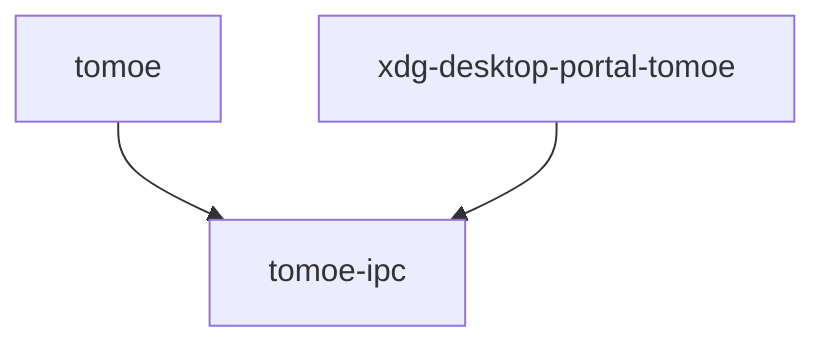

<!-- GENERATED FILE — do not edit by hand.
     Regenerate: scripts/gen-arch.sh
     Freshness is enforced by `nix flake check` (checks.arch-fresh). -->

# Architecture map (generated)

Structural map of the workspace, extracted from the code. For rationale,
invariants, and dataflow, see DESIGN.md / PLAN.md.

## Crate dependency graph

Internal (workspace-local) dependencies only. `A --> B` means A depends on B.



## Crates

| Crate | Description |
|-------|-------------|
| `tomoe` | _no description in Cargo.toml_ |
| `tomoe-ipc` | _no description in Cargo.toml_ |
| `xdg-desktop-portal-tomoe` | _no description in Cargo.toml_ |

## Module structure

Per-crate module/item trees (`cargo modules structure`). Functions are
omitted; types, traits, and module boundaries are the architecture.

### `tomoe`

```

crate tomoe
├── struct Args: pub(crate)
├── enum Command: pub(crate)
├── mod backend: pub(crate)
│   ├── enum Backend: pub
│   ├── mod tty: pub
│   │   ├── type GbmDrmCompositor: pub
│   │   ├── struct OutputDevice: pub
│   │   ├── enum RedrawState: pub
│   │   ├── struct SurfaceDmabufFeedback: pub
│   │   ├── struct TtyData: pub
│   │   ├── type TtyGpuManager: pub
│   │   ├── type TtyRenderer: pub
│   │   └── struct TtySurface: pub
│   └── mod winit: pub
│       └── struct WinitData: pub
├── mod capture: pub(crate)
│   ├── type CaptureElement: pub(self)
│   ├── enum CaptureTarget: pub(self)
│   └── struct SceneParts: pub(self)
├── mod coords: pub(crate)
├── mod cursor: pub(crate)
│   └── struct Cursor: pub
├── mod foreign_toplevel: pub(crate)
│   └── struct ForeignWindowId: pub
├── mod handlers: pub(crate)
├── mod input: pub(crate)
│   ├── enum Action: pub
│   ├── struct Bind: pub
│   ├── enum ModKey: pub
│   └── struct Mods: pub
├── mod ipc: pub(crate)
│   ├── struct Client: pub(self)
│   └── struct IpcState: pub
├── mod layout: pub(crate)
├── mod lock: pub(crate)
│   └── enum LockState: pub
├── mod lua: pub(crate)
│   ├── enum AccelProfile: pub
│   ├── enum ClickMethod: pub
│   ├── struct DisplaySettings: pub
│   ├── struct Hooks: pub(self)
│   ├── struct InputConfig: pub
│   ├── struct InputDeviceSettings: pub
│   ├── struct KeyboardSettings: pub
│   ├── struct LuaRuntime: pub
│   ├── struct LuaScreencastRequest: pub(self)
│   ├── struct LuaWindow: pub(self)
│   ├── struct OutputProps: pub
│   ├── struct PendingBind: pub
│   ├── struct PointerAxisData: pub
│   ├── struct PointerButtonData: pub
│   ├── struct PointerGrab: pub(self)
│   ├── enum RefreshSetting: pub
│   ├── struct ReloadHooks: pub(self)
│   ├── struct Resolution: pub
│   ├── struct Rule: pub(self)
│   ├── enum ScreencastHookOutcome: pub
│   ├── enum ScreencastReply: pub
│   ├── struct ScreencastRequestState: pub(self)
│   ├── enum ScrollMethod: pub
│   ├── struct Settings: pub
│   ├── struct Shared: pub(self)
│   ├── enum SizeSetting: pub
│   ├── struct UiCallbacks: pub(self)
│   ├── struct UiHandle: pub(self)
│   ├── enum UiOp: pub
│   ├── struct WinProps: pub
│   └── enum WindowOp: pub
├── mod process: pub(crate)
│   ├── enum Launch: pub
│   ├── enum ProcessDecl: pub
│   ├── struct ProcessManager: pub
│   ├── struct ProcessSpec: pub
│   ├── enum ReloadPolicy: pub
│   ├── enum RestartPolicy: pub
│   ├── enum RunPolicy: pub
│   └── struct Service: pub(self)
├── mod protocols: pub(crate)
│   ├── mod screencopy: pub
│   │   ├── struct Screencopy: pub
│   │   ├── enum ScreencopyBuffer: pub
│   │   ├── struct ScreencopyFrameInfo: pub
│   │   ├── enum ScreencopyFrameState: pub
│   │   ├── trait ScreencopyHandler: pub
│   │   ├── struct ScreencopyManagerGlobalData: pub
│   │   ├── struct ScreencopyManagerState: pub
│   │   └── struct ScreencopyQueue: pub
│   └── mod tearing_control: pub
│       ├── struct TearingControlData: pub
│       ├── struct TearingControlManagerState: pub
│       └── struct TearingControlSurfaceData: pub(self)
├── mod render: pub(crate)
│   ├── enum OutputRenderElements: pub
│   └── trait TomoeRenderer: pub
├── mod screenshot: pub(crate)
├── mod space: pub(crate)
│   └── struct PhysicalSpace: pub
├── mod state: pub(crate)
│   ├── struct ClientState: pub
│   ├── struct ConfigFingerprint: pub(self)
│   └── struct Tomoe: pub
│       ├── type KeyboardFocus: pub(self)
│       ├── type PointerFocus: pub(self)
│       ├── type SelectionUserData: pub(self)
│       └── type TouchFocus: pub(self)
├── mod ui: pub(crate)
│   ├── struct Ui: pub
│   ├── mod screenshot_ui: pub(self)
│   │   ├── struct ScreenshotUi: pub
│   │   └── enum State: pub(self)
│   ├── mod text: pub
│   │   ├── struct Canvas: pub
│   │   ├── enum Face: pub
│   │   ├── struct Fonts: pub
│   │   └── struct Span: pub
│   └── mod widgets: pub
│       ├── enum Tag: pub
│       ├── enum UiEvent: pub
│       ├── struct WidgetEntry: pub
│       ├── enum WidgetHandler: pub
│       ├── enum WidgetKind: pub
│       ├── enum WidgetSpec: pub
│       └── struct Widgets: pub
└── mod xwayland: pub(crate)
    ├── struct Satellite: pub
    ├── enum ToMain: pub(self)
    ├── struct Unlink: pub(self)
    └── struct X11Connection: pub(self)
```

### `tomoe-ipc`

```

crate tomoe_ipc
├── struct Client: pub
├── struct Event: pub
├── struct Output: pub
├── struct Rect: pub
├── struct Request: pub
└── struct Window: pub
```

### `xdg-desktop-portal-tomoe`

```

crate xdg_desktop_portal_tomoe
├── mod outputs: pub(crate)
│   ├── struct Enumerator: pub(self)
│   └── struct OutputInfo: pub
├── mod pipewire_stream: pub(crate)
│   ├── struct AllocatedSlot: pub(self)
│   ├── struct AppState: pub(self)
│   ├── struct BufferSlot: pub(self)
│   ├── enum BufferSlotStorage: pub(self)
│   ├── struct FdHolder: pub(self)
│   ├── struct PendingFrame: pub(self)
│   ├── struct StreamHandle: pub
│   └── struct StreamSpec: pub
├── mod screencast: pub(crate)
│   ├── enum IpcPick: pub(self)
│   ├── enum LiveStream: pub(self)
│   ├── struct ScreenCast: pub
│   ├── enum Selection: pub(self)
│   ├── mod cursor_modes: pub(self)
│   └── mod source_types: pub(self)
├── mod toplevel_stream: pub(crate)
│   ├── struct AppState: pub(self)
│   ├── struct BufferSlot: pub(self)
│   ├── struct DiscoveredToplevel: pub(self)
│   ├── struct FdHolder: pub(self)
│   ├── struct PendingFrame: pub(self)
│   ├── struct StreamHandle: pub
│   ├── struct StreamInfo: pub
│   └── struct StreamSpec: pub
└── mod toplevels: pub(crate)
    ├── struct Enumerator: pub(self)
    └── struct ToplevelInfo: pub
```
