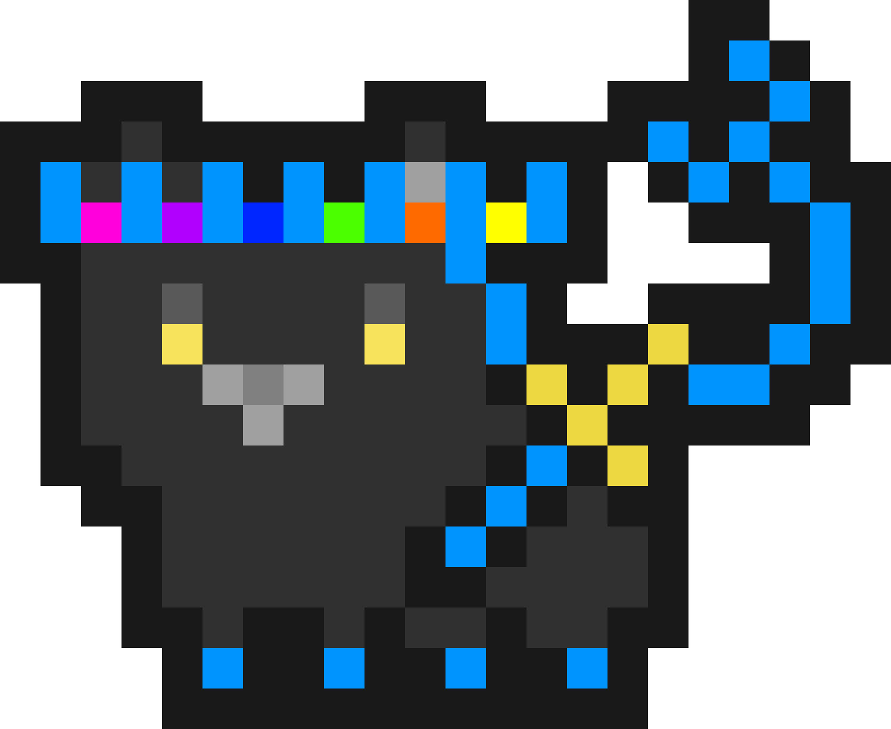
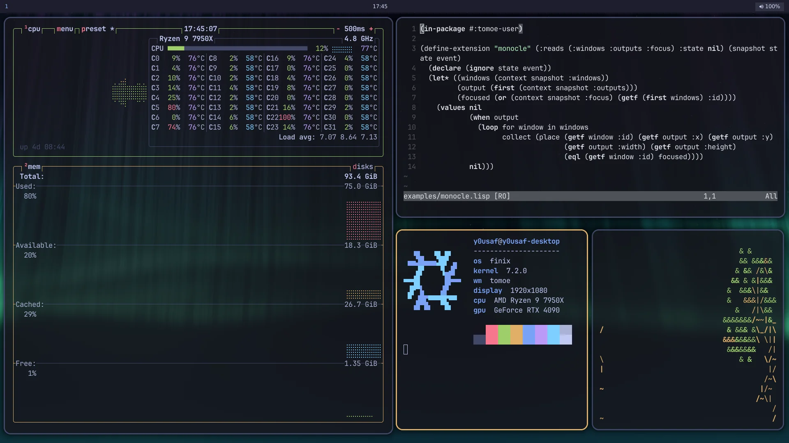
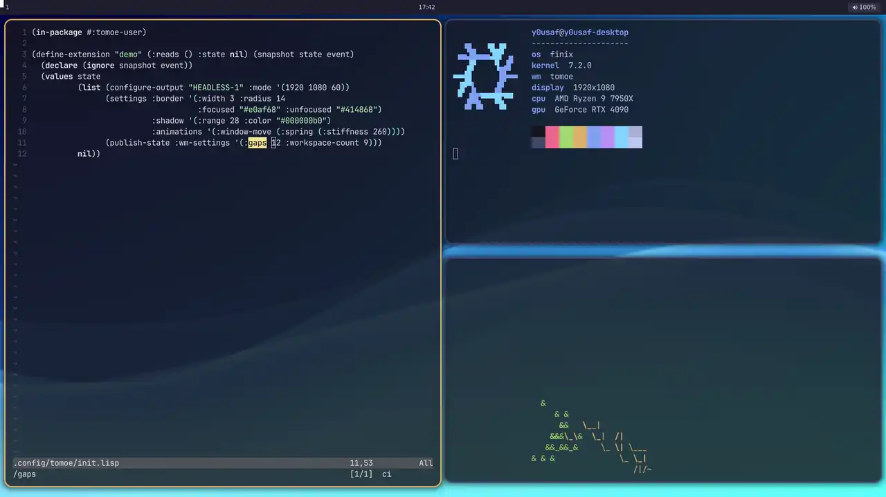

<p align="center"></p>
<br clear="both">

**Tomoe** (巴, after Tomoe, my beloved cat) is a Wayland compositor whose
window manager, bar and wallpaper are Common Lisp you can rewrite while it runs.

It is not a desktop environment. It won't log you in, start your system
services or hide its decisions behind a settings app. You start it from a
terminal, it leaves systemd alone, and every choice it makes is a Lisp file you
can read, replace or delete.

<p align="center"></p>

## Why you might like it

- **Your desktop is a program.** Tiling, keybindings, the bar, the wallpaper
  picker: each is a small extension. The shipped window manager uses the same
  public API your config does, and Tomoe has no special case for it.
- **Change it while it runs.** Save a file and Tomoe picks it up within
  half a second. Mount a different window manager, try it, unmount it:
  your windows stay open the whole time.
- **Mistakes don't take you down.** A file that fails to load leaves the last
  good version running and tells you what broke. `--bare` starts with no policy
  at all and is still a working compositor.
- **Unmount means gone.** An extension owns what it declares: placements,
  bindings, panels, processes, watched files. Unmount it and all of that goes
  with it.
- **One executable.** SBCL with Tomoe's own C core for Wayland, rendering and
  input; no wlroots. It ships a terminal (foot), a launcher (fuzzel), X11
  support through xwayland-satellite, a notification server and a screencast
  portal, so a bare TTY gets you a usable desktop.

## Try it

You need Linux 6.9 or newer and [Nix](https://nixos.org/download) with flakes.

```sh
nix run github:y0usaf/tomoe
```

Inside another Wayland session Tomoe opens as a window, which is the easiest
way to look around. From a TTY it takes over the screen. The first run builds
Tomoe and a few patched dependencies, so give it a while.

| Keys | What they do |
| --- | --- |
| Super+Return | Open a terminal |
| Super+d | Open the launcher |
| Super+j, Super+k | Focus the next or previous window |
| Super+f | Toggle fullscreen |
| Super+1 … 9 | Switch workspace |
| Super+Shift+1 … 9 | Send the focused window to a workspace |
| Super+q | Close the focused window |
| Super+drag | Move a window with the left button, resize it with the right |
| Super+Shift+/ | Show every binding |
| Super+Shift+e | Quit, after asking |

The default layout tiles each workspace by halving the remaining space, with
an eight-pixel gap.

## Make it yours

Tomoe loads `~/.config/tomoe/init.lisp` at startup and reloads it whenever you
save. An extension is one function: it receives a snapshot of the desktop, its
own state and the event that woke it, and returns its new state and the effects
it wants. This one rounds the corners and widens the gaps:

```lisp
(in-package #:tomoe-user)

(define-extension "look" (:reads ()) (snapshot state event)
  (declare (ignore snapshot event))
  (values state
          (list (settings :border '(:radius 10 :focused "#89b4fa"))
                (publish-state :wm-settings '(:gaps 16)))
          nil))
```

Change a number, save, and the windows move:

<p align="center"></p>

A whole window manager fits on a screen. This is
[`examples/monocle.lisp`](examples/monocle.lisp), which shows only the focused
window:

```lisp
(in-package #:tomoe-user)

(define-extension "monocle" (:reads (:windows :outputs :focus) :state nil) (snapshot state event)
  (declare (ignore state event))
  (let* ((windows (context snapshot :windows))
         (output (first (context snapshot :outputs)))
         (focused (or (context snapshot :focus) (getf (first windows) :id))))
    (values nil
            (when output
              (loop for window in windows
                    collect (place (getf window :id) (getf output :x) (getf output :y)
                                   (getf output :width) (getf output :height)
                                   (eql (getf window :id) focused))))
            nil)))
```

Terminals that Tomoe starts have `tomoe` on their `PATH`, and it talks to the
running compositor. From a checkout of this repository, put monocle on top of
the tiling, then take it away again:

```sh
tomoe mount "$PWD/examples/monocle.lisp"
tomoe unmount monocle
```

No window restarts. `tomoe inspect` prints everything the compositor knows,
from windows and outputs to each extension's state and last error.

## Examples

Each file in [`examples/`](examples) mounts on its own.

| File | What it does |
| --- | --- |
| [`monocle.lisp`](examples/monocle.lisp) | One window at a time, filling the screen |
| [`float.lisp`](examples/float.lisp) | Floating windows you move and resize with Super+drag |
| [`deck.lisp`](examples/deck.lisp) | Two columns, each a deck of windows you flip through with Alt+j and Alt+k |
| [`zoomer.lisp`](examples/zoomer.lisp) | An infinite canvas: zoom around the cursor, pan, and keep separate planes |
| [`workspaces.lisp`](examples/workspaces.lisp) | Nine tag-style workspaces |
| [`special.lisp`](examples/special.lisp) | Scratchpads that pop up over the tiling |
| [`layer-inset.lisp`](examples/layer-inset.lisp) | Tiling that makes room for panels |
| [`headset.lisp`](examples/headset.lisp) | Two virtual outputs in place of every monitor, for a headset that streams them |
| [`shader-wallpaper.lisp`](examples/shader-wallpaper.lisp) | Five animated GLSL wallpapers; Super+Shift+b cycles them |
| [`bar.lisp`](examples/bar.lisp) | A top bar with a clock and media and volume panels |
| [`shell.lisp`](examples/shell.lisp) | The smallest bar: a title and a click counter |
| [`battery.lisp`](examples/battery.lisp), [`network.lisp`](examples/network.lisp), [`media.lisp`](examples/media.lisp), [`tray.lisp`](examples/tray.lisp) | Indicators built on Tomoe's session services |

## How it fits together

SBCL runs the policy. A C core linked into the same executable speaks Wayland
through libwayland-server, renders with EGL and GLES2 on GBM, and drives
DRM/KMS, libinput and libseat; it can also run nested in another compositor or
headless. Extensions never touch native state. They return effects, the runtime
settles every extension's effects into one transaction, and only then does the
native side apply it. A broken extension therefore can't leave the screen
half-updated, and because every effect has an owner, unmounting an extension
takes its effects with it.

## Documentation

- [Running Tomoe](docs/running.md): backends, flags, the default desktop, X11 and D-Bus
- [Outputs](docs/outputs.md): modes, scale, placement, mirroring, VRR, colour profiles and virtual outputs
- [Writing extensions](docs/extensions.md): the API, settings, lifecycle and live reload
- [Shell surfaces](docs/shell.md): bars, panels, menus and wallpapers drawn by Tomoe
- [Session services](docs/services.md): notifications, media, battery, backlight, sounds, network and tray
- [Window rules](docs/rules.md): properties for windows that match
- [Control and IPC](docs/control.md): the `tomoe` command and the JSON IPC
- [Internals](docs/internals.md): architecture, source map, protocols and limits

## Status

Tomoe is young, and 0.1 is its first release. Expect the API to move.

- It is my daily desktop on an NVIDIA RTX 4090, running on DRM from a TTY,
  and it runs on an AMD Framework laptop too. Other GPUs get less testing.
- Input methods, touch and tablets are not supported yet, and shell surfaces
  cannot take keyboard focus.
- Extensions are trusted code. They run inside the compositor with your
  permissions.

Bug reports, questions and odd setups are welcome in the
[issues](https://github.com/y0usaf/tomoe/issues).

## Development

```sh
nix build          # the package
nix flake check    # NixOS VM tests; needs KVM
nix develop -c ./dev.sh --backend nested   # run from source
```

## License

[AGPL-3.0](LICENSE).
